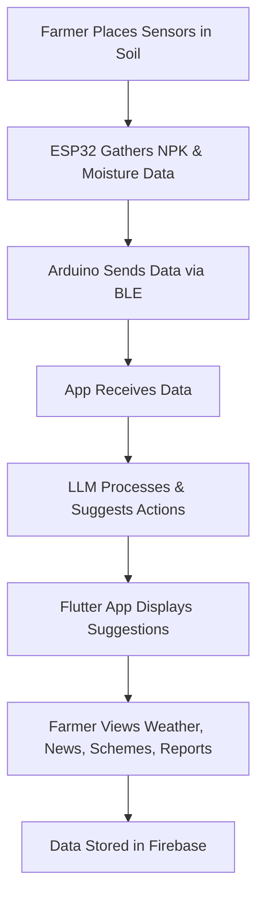

# 🌾 Harvesting Hope – Krishi: The Smart Farming Assistant

[](image.png)

Krishi is an IoT-integrated mobile application under the project **Harvesting Hope**, developed to assist farmers by providing real-time soil health monitoring, personalized agricultural advice, weather updates, news, and details about government schemes and modern farming techniques. It empowers farmers to make informed decisions and adopt sustainable practices.

## 🚀 Features of the App

### 📊 Soil Health Monitoring
- Get real-time NPK and soil moisture readings using IoT sensors.

### 🤖 AI-Powered Suggestions
- The app uses a Large Language Model (LLM) to offer personalized farming tips based on soil data.

### 🌦️ Weather Forecast
- Up-to-date weather insights help farmers plan irrigation and crop schedules better.

### 📰 Agriculture News Bulletin
- Curated news to keep farmers informed about developments in the agriculture sector.

### 📢 Government Schemes & Support
- Information about ongoing and new government initiatives for farmers.

### 📚 Learning & Techniques Hub
- Explore guides on organic farming, modern irrigation methods, and sustainable practices.

### 📁 Reports Management
- Generate, view, and store custom and past reports for reference.

## ⚙️ How the App Works

1. The farmer places NPK and Soil Moisture sensors in their field.
2. The ESP32 microcontroller collects data from the sensors.
3. Using Arduino code, the ESP32 sends this data to the backend.
4. The app, built using Flutter, directly receives the sensor readings through Bluetooth. (Use Sensor Data button)
5. LLM model uses these readings to predict suitable suggestions.
6. All user data, reports, and preferences are stored securely in Firebase.
7. Farmers can view AI-generated suggestions, weather, news, schemes, and reports within the app.


## 🧰 Technologies Used

| Technology | Purpose |
|------------|---------|
| FlutterFlow | No-code platform to build the mobile app interface |
| Firebase | Backend for user authentication, real-time database, and storage |
| Arduino | Programming the ESP32 microcontroller for sensor communication |
| LLM (Large Language Model) | Generates intelligent crop/farming suggestions from sensor data |

## 🔄 Workflow of Krishi



## 📱 App Screenshots


## 🛠️ Installation and Setup

### Prerequisites
- Flutter SDK
- Arduino IDE
- ESP32 Development Board
- NPK Sensor
- Soil Moisture Sensor
- Firebase Account

### Mobile App Setup
1. Clone this repository
```bash
git clone https://github.com/yourusername/harvesting-hope.git
cd harvesting-hope
```

2. Install dependencies
```bash
flutter pub get
```

3. Configure Firebase
   - Create a new Firebase project
   - Add your `google-services.json` to the `android/app` directory
   - Add your `GoogleService-Info.plist` to the `ios/Runner` directory

4. Run the app
```bash
flutter run
```

## 📜 License

This project is licensed under the MIT License - see the [LICENSE](LICENSE) file for details.

## 🌟 Project Vision

Harvesting Hope aims to integrate smart technology with agriculture through Krishi, enabling farmers to take control of their crop decisions and agricultural practices with confidence and ease.

## 🙏 Acknowledgements

- [FlutterFlow](https://flutterflow.io)
- [Firebase](https://firebase.google.com)
- [OpenWeather API](https://openweathermap.org/api)
- All the farmers who participated in our pilot program
